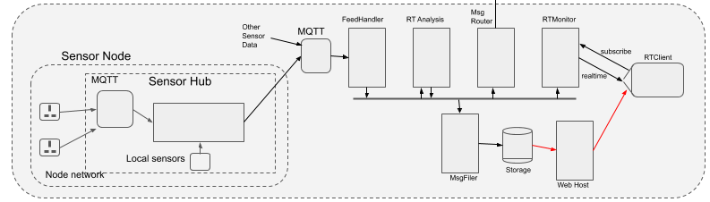
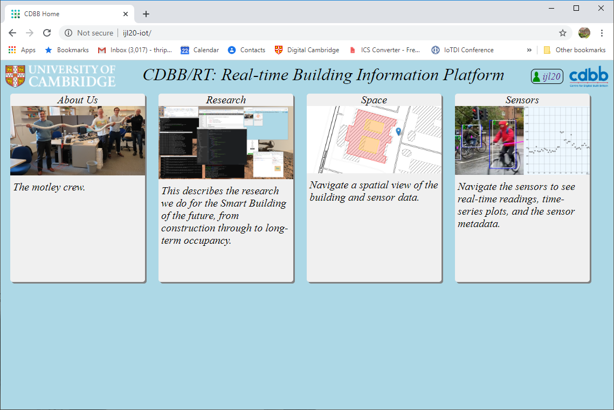
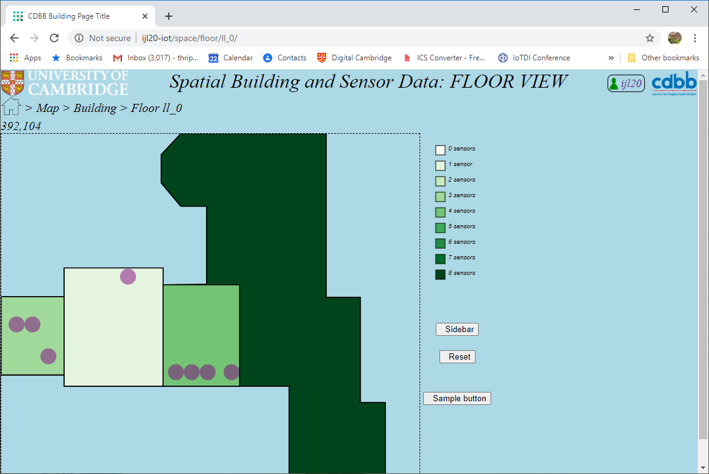
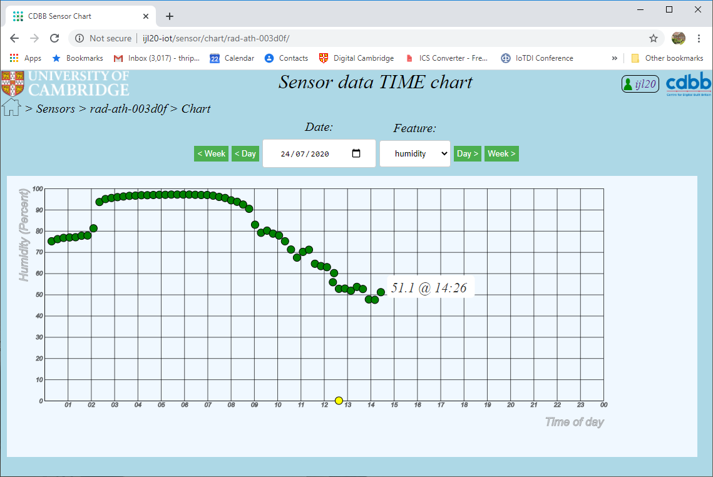

# Adaptive City Program Web System

## Overview
ACP Web provides the web access to the ACP Platform, supporting three main capabilities:
1. A visual display of data collected via ACP Server.
2. API's providing 3rd-party access to the collected data (both http/restful and zip download).
3. A highly flexible 'SmartPanel' system supporting web display of real-time content.

In the Adaptive City Platform architecture diagram below, `acp_web` is the "Web Host" shown bottom right:

ACP Web provides the homepage, as below (as of 2020-07-24, during development):

Currently the main functional aspects of the web content are to:

* Browse a *spatial* view of a region (i.e. map) and in-building information (typically floorplans) showing also the
installed sensors in that view, e.g.:

* View the *readings* for any sensor in a value/time plot, e.g. :

* View the metadata for any sensor, providing relatively static information (compared to *readings*) for example the location of a fixed
sensor, its type.

* View the metadata for any *sensor type*, (e.g. a "RadioBridge IP67 Air Temperature and Humidity Sensor"), which will provide common
information for that type, including how to interpret the *readings*.

## Installation

See [INSTALL_UPDATE.md](INSTALL_UPDATE.md)
